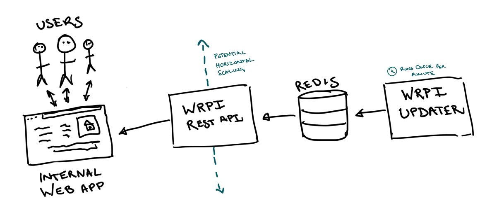

Random Price Index Service
==========================

This is a test for people applying to the company with a mind to get involved
with our technical infrastructure (Devops, Secops, SRE, Backend Dev, Data
engineer etc).

Take as long as you need or you think is reasonable. You don't need to
complete all the requirements if you are pushed for time, however your
solution should give us enough to work with to confirm that you know what
you're doing.

We have set up a google cloud project for your use in this test, and provided
you the details and access via email (if you haven't received this let us
know). The project is largely a blank slate, so feel free use whatever tooling
or services you feel are appropriate to complete the task below, but try and
avoid running up a crazy bill or exposing us to any potential security or
legal problems. 

Any configuration or documentation you might generate that you would like us
to consider, please compress and return to us along with a copy of this git
repository. If we could ask you not to make your solution public that would be
appreciated.

Introduction
------------

The Wayhome Random Price Index (or WRPI) is an exciting new (and importantly
FICTIONAL) metric, similar in nature to the Retail Price Index (RPI) or the
Consumer Price Index (CPI). Our data science team believe that WRPI is
critical to our ability to buy houses, and as such should be integrated into
our internal tooling post haste!

WRPI is a decimal number between 0 and 100. Unlike RPI and CPI that are only
published once a month, WRPI can be updated much more frequently (around once
per minute). Anyone consuming WRPI will need to know both the current value of
WRPI and the time that it was generated at.

The Service
-----------

The backend team have worked with the data team to put together two python
applications to satisfy this business function. See a service diagram below:



The changes to the web app are underway already, we just need to get these two
applications running somewhere.

### The Updater (`updater.py`)

The updater calculates the new value whenever it's run and stores the result
in a redis database. The expectation is that this application will run
approximately once per minute. The odd delay or duplication will not cause
critical problems.

It takes the following configuration as environmental variables:

* `REDIS_HOST`: host for the redis database, defaults to `localhost`
* `REDIS_DB`: the number of the database to connect to, defaults to `1`
* `REDIS_PASS`: password for the redis database, default to a blank string (or
  in other words: no password)
* `REDIS_PORT`: port for the redis database, defaults to `6379`

The application sets the following keys in the database:

* `wrpi-latest`: the latest WRPI value
* `wrpi-timestamp`: the timestamp of the last calculation in ISO8601 format

### The API (`api.py`)

This is a simple HTTP API that returns the current value of WRPI along with
the timestamp it was generated at. It should be publicly exposed to the
internet so that it might be accessed by our internal tooling (a browser based
SPA). The application handles it's own authentication but you will need to
configure and securely store the access password when you deploy the
application.

The API should function something like this

```http
GET 127.0.0.1/v0/wrpi HTTP/1.1
Host: 127.0.0.1
Authorization: Basic Ym9iOnBhc3N3b3Jk

200 OK
Content-Type: application/json
Content-Length: 123

{
    "latest_value": 69.420,
    "latest_calculation_at": "2021-02-20T18:06:47+0000"
}
```

Connecting via IP address is fine, the API doesn't need to be secured by SSL.

The application takes the following configuration as environmental variables:

* `REDIS_HOST`: host for the redis database, defaults to `localhost`
* `REDIS_DB`: the number of the database to connect to, defaults to `0`
* `REDIS_PASS`: password for the redis database, default to a blank string (or
  in other words: no password)
* `REDIS_PORT`: port for the redis database, defaults to `6379`
* `APP_PASSWORD`: the password users will need to enter in order to access
  the app. The application doesn't have a default but our users expect to use
  the same password we use for all our internal tools: `security-goes-brrrrrr`

Docker
------

The backend team have already packaged the two applications into docker images
for you. You can find them attached to this github repository, or you can pull
the images directly using the URI's below.

ghcr.io/wayhomeuk/random-price-index-service/updater:latest
ghcr.io/wayhomeuk/random-price-index-service/api:latest


Things that we would like to see
--------------------------------

* We are currently a kubernetes shop and we would expect to see at least some
  demonstrated knowledge of kubernetes in your solution.
* A reproducible solution, i.e. configuration as code and clear documentation
* No sensitive data (such as kubernetes master passwords) being included in
  your code.
* We work with [git](https://git-scm.com/) for version control, please include
  your `.git` folder when you compress this folder and send it back to us. You
  should feel free to commit at any point in the process.

Stretch Goals
-------------

Don't feel like you need to go after any of these, providing a solution to the
above will be enough for us to make an assessment, this is for people that
want to show off and for us to virtue signal.

* Monitoring and alerts.
* DNS and SSL for the API endpoint.
* Resource requests and limits.
